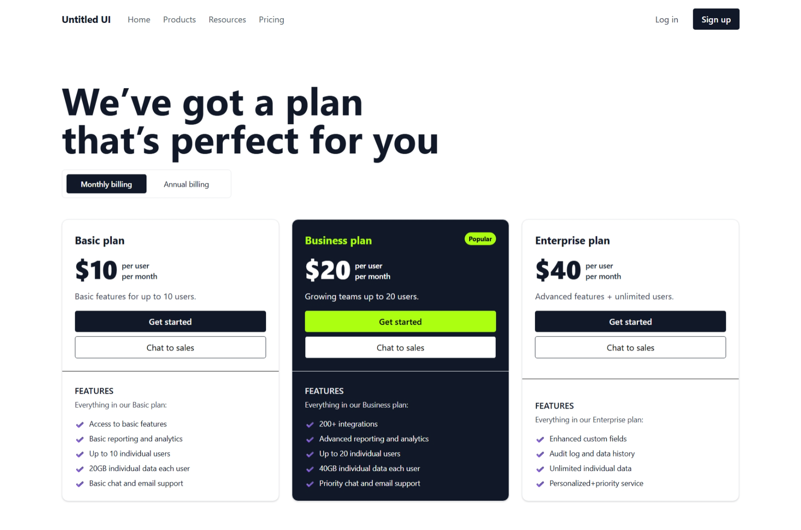

# Pricing Page - Untitled UI (Dribbble Inspired)

This is a responsive pricing page built using **HTML** and **Tailwind CSS**, inspired by a [Dribbble design by Jordan Hughes](https://dribbble.com/shots/18890939-Pricing-page-Untitled-UI).

## 🔧 Tech Stack

- HTML5
- Tailwind CSS (via CDN)
- JavaScript

## 📦 Features

- Fully responsive layout
- Three pricing tiers: **Basic**, **Business**, and **Enterprise**
- Monthly vs. annual billing toggle 
- Mobile-first, clean structure
- Easily extendable and customizable

## 🧪 How to Run

1. Clone or download this repository.
2. Open the `index.html` file in your browser.
3. That's it—no build tools needed!

## ✨ Screenshot

> ⚠️ The original design belongs to Jordan Hughes. I have developed this layout from scratch using code, based on the visual reference. A screenshot of the implemented version is attached above.

## 📌 Notes

- This project is a **frontend-only clone** for practice and demonstration.
- No frameworks or build systems are used—just raw HTML, JavaScript and Tailwind via CDN.

## 📃 License

This project is for **demo purposes** only and is **not affiliated with Untitled UI**. Please respect the original design copyright.

---

💡 Developed by [Mahak](https://github.com/dev-namra) – Frontend Developer
